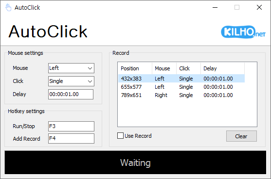

# AutoClick

**決めた位置を決めた間隔でマウスの代わりにクリックし、複数の位置を順番にクリックする手順も記録して使える、Windows 用の無料マウス自動クリック ソフト。**

[English](README.md) · [한국어](README.ko.md) · [简体中文](README.zh-CN.md) · 日本語 · [Español](README.es.md) · [Português (Brasil)](README.pt-BR.md) · [Français](README.fr.md)

> この文書は翻訳版です。内容に相違がある場合は[韓国語版](README.ko.md)が正となります。

-0078D4)

## 概要

同じボタンを何十回、何百回とクリックしなければならない作業があります。AutoClick はそのクリックをマウスの代わりに行います。

押すボタン(左 · 右 · ホイール)、1 回押すか 2 回押すか、何秒ごとに押すかを決めておき、ホットキー(既定は **F3**)を押すと開始します。同じホットキーをもう一度押すと止まります。ホットキーはほかのプログラムを見ているときにも効くので、AutoClick のウインドウを前面に出しておく必要はありません。

1 か所だけでなく複数の位置を順番にクリックしたい場合は **レコード** を使います。マウスをクリックしたい位置に置いてホットキー(既定は **F4**)を押すと、その位置がリストに 1 行ずつ追加されます。**レコード使用** にチェックを入れて実行すると、リストの順番どおりに繰り返しクリックします。

## 主な機能

- **マウス自動クリック** — 左 · 右 · ホイール ボタンをシングルまたはダブル クリックで繰り返し押します。
- **間隔の範囲** — 1 秒ごとのように一定の間隔でも、1 秒~3 秒のあいだで毎回違う間隔でもクリックできます。1/100 秒単位で設定します。
- **グローバル ホットキー** — ほかのプログラムを使っていても、キー 1 つで開始・停止できます。キーは好きな組み合わせに変えられます。
- **レコード** — 複数の位置を順番にクリックするパターンを作り、位置ごとにボタン · クリック · 間隔を個別に決められます。
- **パターンの保存** — レコードをファイルに保存し、必要なときに開けます。最後のリストは次回の起動時にそのまま戻ります。
- **繰り返し回数** — 決めた回数だけクリックすると自動で止まります。空欄にすると、止めるまでクリックし続けます。
- **カーソルを保持** — 決めた位置をクリックしたあと、マウス カーソルを元の位置に戻します。
- **通知** — 開始と停止を Windows の通知でお知らせします。開始の通知には停止用のホットキーも表示されます。
- **ダーク モード** — Windows のアプリ モード(ライト · ダーク)に合わせて画面の色が変わります。
- **8 言語** — 韓国語 · 英語 · 日本語 · 中国語 · ロシア語 · イタリア語 · フランス語 · スペイン語。

## ダウンロード / インストール

| 種類 | リンク |
|---|---|
| インストール版 | [ダウンロード](https://down.kilho.net/autoclick?lang=ja) |
| ポータブル版 (ZIP) | [ダウンロード](https://down.kilho.net/autoclick?lang=ja&nosetup) |

インストール版はインストールが終わるとすぐに AutoClick を起動します。ポータブル版は ZIP を展開して `AutoClick.exe` を実行するだけです。どちらも機能は同じです。

## 使い方

### はじめての使い方

1. AutoClick を起動します。
2. **マウス設定** で押すボタン(**マウス**)、1 回押すか 2 回押すか(**クリック**)、クリックの間隔(**ディレイ**)を選びます。最初は 1 秒ごとに左ボタンを 1 回押す設定になっています。
3. マウス カーソルをクリックしたい位置に置きます。
4. **F3** を押します。下のステータス バーが **実行中です。** に変わり、その位置を決めた間隔でクリックし始めます。
5. 終わったら **F3** をもう一度押します。ステータス バーが **待機中です** に戻ります。

### 画面構成

| 要素 | 役割 |
|---|---|
| **ホーム** · **テスト** · **寄付する** | 上部メニュー。**テスト** はクリックを試せるマウス テスト ページを開きます |
| KILHO.net ロゴ | AutoClick の紹介ページを開きます |
| **マウス設定** | **マウス**(左 · 右 · ホイール) · **クリック**(シングル · ダブル) · **ディレイ**(クリックの間隔。2 つの欄で範囲) |
| **ホットキー設定** | **手始め/中止**(既定は F3) · **レコード追加**(既定は F4) |
| **その他設定** | **繰り返し** · **位置**(保持 · 変更) · **通知を使う**(使用する · 使用しない) |
| **レコード** リスト | クリックする位置を順番に並べたリスト。列は **ポジション** · **マウス** · **クリック** · **ディレイ** |
| **レコード使用** | チェックを入れると、実行時にリストの順番どおりにクリックします |
| **クリア** · **開く** · **保存** | リストをすべて消します / 保存したリストを開きます / リストをファイルに保存します |
| ステータス バー | **待機中です** または **実行中です。** |

### こんなときは

**1 か所をクリックし続ける**
カーソルをクリックしたい位置に置いて **F3** を押すと、開始したときにカーソルがあった位置をクリックし続けます。**位置** が **保持** なら、クリックのたびにカーソルを元の場所に戻すので、そのあいだにマウスをほかの場所へ動かしても、クリックする位置は変わりません。

**カーソルについてクリックする**
**位置** を **変更** にすると、開始時の位置ではなく、クリックするその瞬間にカーソルがある位置をクリックします。実行中にマウスを動かして、クリックする場所を変えながら使いたいときに便利です。

**間隔を毎回少しずつ変える**
**ディレイ** の 2 つの欄に範囲を入れます。たとえば `00:01.00` と `00:03.00` を入れると、1 秒から 3 秒のあいだで毎回違う間隔でクリックします。2 つの欄が同じなら、間隔はいつも同じです。欄は `分:秒.1/100秒` の形なので、数字を順に打つだけで正しい位置に入り、最長で 99 分 59.99 秒まで入れられます。

**前の欄だけ変えてもいいですか**
前の欄を変えてほかの欄に移ると、後ろの欄が前の欄に合わせて変わります。後ろの欄を自分で変えたあとはその値を守るので、範囲を決めたいときは前の欄を先に、後ろの欄をあとに入れてください。後ろの欄が前の欄より小さいと、前の欄の値に合わせられます。

**決めた回数だけクリックして止める**
**繰り返し** に数字を入れます。その回数だけクリックすると自動で止まり、**通知を使う** がオンなら「繰り返し回数に達したため実行を終了しました。」という通知とともに、タスク バーの AutoClick が点滅してお知らせします。欄を空にしておくと(**なし** が薄く表示された状態)、止めるまでクリックし続けます。ダブル クリックも 1 回と数えます。

**複数の位置を順番にクリックする(レコード)**
1. **マウス設定** でボタン · クリック · ディレイを選びます。
2. カーソルを 1 つ目の位置に置いて **F4** を押します。**レコード** リストに、その位置と今選んでいるボタン · クリック · ディレイが 1 行入ります。
3. 次の位置ごとに同じように **F4** を押します。行ごとにボタンやディレイを変えたいときは、**F4** を押す前に **マウス設定** を変えてください。
4. **レコード使用** にチェックを入れて **F3** を押すと、最初の行から順にクリックし、最後の行のあとはまた最初の行に戻ります。今クリックしている行がリストに表示されます。

各行の **ディレイ** は、その位置をクリックしてから次の行に移るまで待つ時間です。

**レコードの順番を変える・1 行だけ消す**
リストでその行を右クリックすると **上へ移動** · **下へ移動** · **削除** が出ます。リストをすべて消すには **クリア** を押し、確認ウインドウで **はい** を押します。実行中はリストを変えられないので、先に止めてください。

**作ったパターンを複数持っておいて使い分ける**
**保存** で今のリストをファイルに残し、必要なときに **開く** で読み込みます。作業ごとにパターンのファイルを 1 つずつ用意しておくと便利です。保存しなくても、AutoClick を閉じたときのリストは次回の起動時にそのまま戻ります。以前のバージョンで保存したレコード ファイルもそのまま開けます。

**レコード リストのディレイの見方**
間隔が 1 つなら `00:01.00`、範囲なら `01:01.00~05:03.00` のように、入力欄と同じ形で表示されます。範囲が長くて切れて見えるときは、マウスを乗せるか、列見出しのあいだの境界をドラッグして幅を広げてください。

**ホットキーを変えたいとき**
**ホットキー設定** の欄をクリックすると「キーを押してください」に変わります。そこで使いたいキー、または **Ctrl** · **Alt** · **Shift** を組み合わせたキー(例: **Ctrl+Shift+F3**)を押すと、すぐに変わって保存されます。欄で **Esc** を押すと、そのホットキーを空にします(**なし**)。ゲームやほかのプログラムでよく使うキーと重ならないキーを選んでください。

**ほかのプログラムとホットキーが重なるとき**
ほかのプログラムが同じキーを先に使っていると、AutoClick がそのことをお知らせします。別のキーに変えるか、そのプログラムを閉じてください。そのプログラムを閉じたあとで AutoClick を起動し直すと、元のキーがまた使えるようになります。2 つのホットキーに同じキーを入れると、すでに別の機能で使っているとお知らせし、受け付けません。

**通知がいらないとき**
**通知を使う** を **使用しない** にすると、開始 · 停止 · 繰り返し完了の通知を出しません。オンにしておくと、開始時に「終了するには同じショートカットをもう一度押してください (F3)」のように止めるキーを教えてくれるので、ホットキーを忘れたときに役立ちます。

**ホイール ボタンを押す**
**マウス** を **ホイール** にすると、ホイールを回すのではなく、ホイール ボタン(中ボタン)を押します。ブラウザーでリンクを新しいタブで開くときのように、中ボタンを使う場面で使います。

**始める前に試してみる**
上部の **テスト** を押すと、左 · ホイール · 右ボタンのクリックとダブル クリックの回数を数えるマウス テスト ページがブラウザーで開きます。ボタン · クリック · ディレイを変えながら、思いどおりにクリックされるかを先に確かめられます。

**実行中に設定を変えたいとき**
実行中は、うっかり変わらないように入力欄がロックされます。**F3** で止めてから変更し、もう一度 **F3** を押してください。

**すでに起動しているのにもう一度起動したとき**
AutoClick は 1 つしか起動しません。もう一度起動しても新しく開かず、すでに開いているウインドウが前面に出ます。ウインドウのタイトルには現在のバージョンが表示されます。

## 設定

設定ウインドウはありません。ホットキー · **位置** · **通知を使う** は変えたその場で記憶され、レコード リストは閉じるときに保存されて次回の起動時に戻ります。次の項目は AutoClick が自動で合わせます。

| 項目 | 合わせる対象 |
|---|---|
| 言語 | Windows の地域設定(対応していない言語なら英語) |
| 画面の色 | Windows のアプリ モード(ライト · ダーク) — AutoClick の起動中に変えてもすぐに追従します |

## 動作環境

- Windows 10 · Windows 11(64 ビット)
- 管理者権限は必要ありません。
- 別途インストールが必要なコンポーネントはありません。
- インターネット接続は新しいバージョンのお知らせにだけ使います。接続がなくても、すべての機能をそのまま使えます。

## アップデート

AutoClick は自動でアップデート **しません**。起動時に新しいバージョンがあるかを確認してお知らせを表示し、**[はい]** を押すとダウンロード ページを開いてプログラムを終了します。新しいバージョンは社内での検証を経て手動で配布され、[AutoClick のページ](https://kilho.net/autoclick)でお知らせします。[アップデート ポリシーのお知らせ](https://en.kilho.net/archives/notice/2940)もご覧ください。

## ライセンス

AutoClick は**フリーウェア**です。会社、自宅、官公庁、学校など、どこでも制限なく無料で使え、自由に再配布できます。

## リンク

- ウェブサイト: <https://kilho.net/autoclick>
- フォーラム: <https://kilho.top/forum/qna>
- X (Twitter): <https://www.twitter.com/kilhonet>

© KILHO.NET
