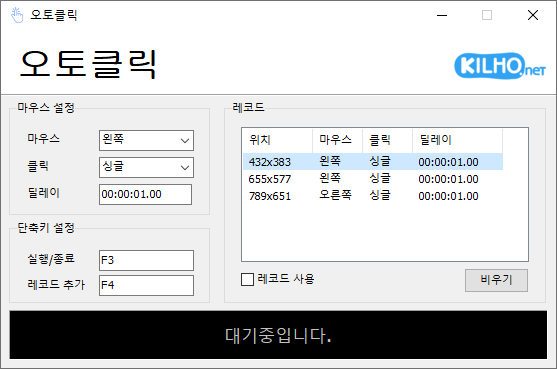

# 오토클릭

**정한 위치를 정한 간격으로 마우스가 대신 눌러 주고, 여러 위치를 차례로 누르는 순서도 기록해 두고 쓰는 Windows 무료 마우스 자동 클릭 프로그램.**

[English](README.md) · 한국어 · [简体中文](README.zh-CN.md) · [日本語](README.ja.md) · [Español](README.es.md) · [Português (Brasil)](README.pt-BR.md) · [Français](README.fr.md)

-0078D4)

## 개요

같은 버튼을 수십, 수백 번 눌러야 하는 일이 있습니다. 오토클릭은 그 일을 마우스 대신 해 줍니다.

누를 버튼(왼쪽 · 오른쪽 · 휠), 한 번 누를지 두 번 누를지, 몇 초마다 누를지를 정해 두고 단축키(기본 **F3**)를 누르면 시작합니다. 같은 단축키를 다시 누르면 멈춥니다. 단축키는 다른 프로그램을 보고 있을 때도 들으므로, 오토클릭 창을 앞에 둘 필요가 없습니다.

한 자리만 누르는 것이 아니라 여러 자리를 차례로 눌러야 한다면 **레코드** 를 씁니다. 마우스를 누를 자리에 올려 두고 단축키(기본 **F4**)를 누르면 그 위치가 목록에 한 줄씩 쌓이고, **레코드 사용** 을 체크하고 실행하면 목록 순서대로 돌아가며 누릅니다.

## 주요 기능

- **마우스 자동 클릭** — 왼쪽 · 오른쪽 · 휠 버튼을 싱글 또는 더블 클릭으로 반복해서 누릅니다.
- **간격 범위** — 1초마다처럼 일정하게, 또는 1초~3초 사이에서 매번 다르게 누를 수 있습니다. 1/100초 단위로 정합니다.
- **전역 단축키** — 다른 프로그램을 보고 있어도 단축키 하나로 시작하고 멈춥니다. 키는 원하는 조합으로 바꿀 수 있습니다.
- **레코드** — 여러 위치를 순서대로 누르는 패턴을 만들고, 위치마다 버튼 · 클릭 · 간격을 따로 정합니다.
- **패턴 저장** — 레코드를 파일로 저장해 두고 필요할 때 불러옵니다. 마지막 목록은 다음 실행 때 그대로 돌아옵니다.
- **반복 횟수** — 정한 횟수만큼 누르면 저절로 멈춥니다. 비워 두면 멈출 때까지 계속 누릅니다.
- **커서 유지** — 정한 자리를 누른 뒤 마우스 커서를 원래 자리로 돌려놓습니다.
- **알림** — 시작하고 멈출 때 Windows 알림으로 알려 줍니다. 시작 알림에는 멈추는 단축키가 함께 나옵니다.
- **다크 모드** — Windows 의 앱 모드(밝게 · 어둡게)를 따라 화면 색이 바뀝니다.
- **8개 언어** — 한국어 · 영어 · 일본어 · 중국어 · 러시아어 · 이탈리아어 · 프랑스어 · 스페인어.

## 다운로드 / 설치

| 종류 | 링크 |
|---|---|
| 설치판 | [다운로드](https://down.kilho.net/autoclick?lang=ko) |
| 무설치판 (ZIP) | [다운로드](https://down.kilho.net/autoclick?lang=ko&nosetup) |

설치판은 설치가 끝나면 오토클릭을 바로 실행합니다. 무설치판은 ZIP 을 풀고 `AutoClick.exe` 를 실행하면 됩니다. 두 판의 기능은 같습니다.

## 사용법

### 처음 사용하기

1. 오토클릭을 실행합니다.
2. **마우스 설정** 에서 누를 버튼(**마우스**), 한 번 누를지 두 번 누를지(**클릭**), 누르는 간격(**딜레이**)을 고릅니다. 처음에는 1초마다 왼쪽 버튼을 한 번씩 누르도록 되어 있습니다.
3. 마우스 커서를 누를 자리에 올려 둡니다.
4. **F3** 을 누릅니다. 아래쪽 상태 줄이 **실행중입니다.** 로 바뀌고 그 자리를 정한 간격으로 누르기 시작합니다.
5. 다 됐으면 **F3** 을 한 번 더 누릅니다. 상태 줄이 **대기중입니다.** 로 돌아옵니다.

### 화면 구성

| 요소 | 역할 |
|---|---|
| **처음화면** · **테스트** · **후원하기** | 위쪽 메뉴. **테스트** 는 클릭을 시험해 볼 수 있는 마우스 테스트 페이지를 엽니다 |
| KILHO.net 로고 | 오토클릭 소개 페이지를 엽니다 |
| **마우스 설정** | **마우스**(왼쪽 · 오른쪽 · 휠) · **클릭**(싱글 · 더블) · **딜레이**(누르는 간격, 두 칸은 범위) |
| **단축키 설정** | **실행/종료**(기본 F3) · **레코드 추가**(기본 F4) |
| **기타 옵션** | **반복횟수** · **위치변경**(유지 · 변경) · **알림 사용**(사용함 · 사용안함) |
| **레코드** 목록 | 누를 위치를 순서대로 담은 목록. 열은 **위치** · **마우스** · **클릭** · **딜레이** |
| **레코드 사용** | 체크하면 실행할 때 목록 순서대로 누릅니다 |
| **비우기** · **열기** · **저장** | 목록을 모두 지웁니다 / 저장해 둔 목록을 불러옵니다 / 목록을 파일로 저장합니다 |
| 상태 줄 | **대기중입니다.** 또는 **실행중입니다.** |

### 이럴 때 이렇게

**한 자리를 계속 누르기**
커서를 누를 자리에 두고 **F3** 을 누르면, 시작할 때 커서가 있던 그 자리를 계속 누릅니다. **위치변경** 이 **유지** 이면 누를 때마다 커서를 원래 있던 곳으로 돌려놓으므로, 그동안 마우스를 다른 곳으로 옮겨도 누르는 자리는 바뀌지 않습니다.

**커서를 따라다니며 누르기**
**위치변경** 을 **변경** 으로 바꾸면 시작할 때의 자리가 아니라 누르는 그 순간 커서가 있는 자리를 누릅니다. 실행 중에 마우스를 움직여 누를 곳을 바꿔 가며 쓸 때 편합니다.

**간격을 매번 조금씩 다르게 하기**
**딜레이** 의 두 칸에 범위를 넣습니다. 예를 들어 `00:01.00` 과 `00:03.00` 을 넣으면 1초에서 3초 사이에서 매번 다른 간격으로 누릅니다. 두 칸이 같으면 늘 같은 간격입니다. 칸은 `분:초.1/100초` 꼴이라 숫자만 차례로 치면 자리에 맞게 들어가고, 가장 길게는 99분 59.99초까지 넣을 수 있습니다.

**앞 칸만 바꿔도 되나요**
앞 칸을 고치고 다른 칸으로 넘어가면 뒤 칸이 앞 칸을 따라 맞춰집니다. 뒤 칸을 직접 고친 뒤에는 그 값을 그대로 지키므로, 범위를 정하고 싶으면 앞 칸을 먼저, 뒤 칸을 나중에 넣으면 됩니다. 뒤 칸이 앞 칸보다 작으면 앞 칸 값으로 맞춰집니다.

**정한 횟수만 누르고 멈추기**
**반복횟수** 에 숫자를 넣습니다. 그만큼 누르면 저절로 멈추고, **알림 사용** 이 켜져 있으면 "반복횟수를 다 채워 실행을 끝냈습니다." 알림과 함께 작업 표시줄의 오토클릭이 깜빡여 알려 줍니다. 칸을 비워 두면(**사용안함** 이 흐리게 보이는 상태) 멈출 때까지 계속 누릅니다. 더블클릭도 한 번으로 셉니다.

**여러 자리를 차례로 누르기 (레코드)**
1. **마우스 설정** 에서 버튼 · 클릭 · 딜레이를 고릅니다.
2. 커서를 첫 번째 자리에 올리고 **F4** 를 누릅니다. **레코드** 목록에 그 위치와 지금 고른 버튼 · 클릭 · 딜레이가 한 줄 들어갑니다.
3. 다음 자리마다 같은 방법으로 **F4** 를 누릅니다. 줄마다 버튼이나 딜레이를 바꾸고 싶으면 **F4** 를 누르기 전에 **마우스 설정** 을 바꾸면 됩니다.
4. **레코드 사용** 을 체크하고 **F3** 을 누르면 첫 줄부터 차례로 누르고, 마지막 줄 다음에는 다시 첫 줄로 돌아갑니다. 지금 누르는 줄이 목록에 표시됩니다.

각 줄의 **딜레이** 는 그 자리를 누른 뒤 다음 줄로 넘어가기까지 기다리는 시간입니다.

**레코드 순서를 바꾸거나 한 줄만 지우기**
목록에서 그 줄을 오른쪽 클릭하면 **위로 이동** · **아래로 이동** · **삭제** 가 나옵니다. 목록을 모두 지우려면 **비우기** 를 누르고 확인 창에서 **예** 를 누릅니다. 실행 중에는 목록을 바꿀 수 없으니 먼저 멈추세요.

**만든 패턴을 여러 개 두고 골라 쓰기**
**저장** 으로 지금 목록을 파일로 남겨 두고, 필요할 때 **열기** 로 불러옵니다. 일마다 다른 패턴을 파일 하나씩 두면 편합니다. 따로 저장하지 않아도 오토클릭을 닫을 때의 목록은 다음에 실행할 때 그대로 돌아옵니다. 예전 판에서 저장한 레코드 파일도 그대로 열립니다.

**레코드 목록의 딜레이 읽기**
간격이 하나면 `00:01.00` 처럼, 범위면 `01:01.00~05:03.00` 처럼 입력칸과 같은 꼴로 보입니다. 범위가 길어 잘려 보이면 마우스를 올려 보거나 열 제목 사이 경계를 끌어 폭을 넓히면 됩니다.

**단축키를 바꾸고 싶을 때**
**단축키 설정** 의 칸을 누르면 "키를 누르십시오" 로 바뀝니다. 그때 쓸 키나 **Ctrl** · **Alt** · **Shift** 를 섞은 조합(예: **Ctrl+Shift+F3**)을 누르면 바로 바뀌고 저장됩니다. 칸에서 **Esc** 를 누르면 그 단축키를 비웁니다(**없음**). 게임이나 다른 프로그램에서 자주 쓰는 키와 겹치지 않는 키를 고르세요.

**다른 프로그램과 단축키가 겹칠 때**
다른 프로그램이 같은 키를 먼저 쓰고 있으면 오토클릭이 그렇다고 알려 줍니다. 다른 키로 바꾸거나 그 프로그램을 닫으면 되고, 그 프로그램이 꺼진 뒤 오토클릭을 다시 실행하면 원래 키가 다시 걸립니다. 두 단축키에 같은 키를 넣으면 이미 다른 기능에 쓰고 있다고 알려 주고 받지 않습니다.

**알림이 필요 없을 때**
**알림 사용** 을 **사용안함** 으로 바꾸면 시작 · 멈춤 · 반복 완료 알림을 띄우지 않습니다. 켜 두면 시작할 때 "끝내려면 같은 단축키를 다시 누르십시오 (F3)" 처럼 멈추는 키를 알려 주어, 단축키를 잊었을 때 도움이 됩니다.

**휠 버튼 누르기**
**마우스** 를 **휠** 로 고르면 휠을 굴리는 것이 아니라 휠 버튼(가운데 버튼)을 누릅니다. 브라우저에서 링크를 새 탭으로 여는 동작처럼 가운데 버튼을 쓰는 곳에 씁니다.

**시작하기 전에 시험해 보기**
위쪽의 **테스트** 를 누르면 왼쪽 · 휠 · 오른쪽 버튼의 클릭과 더블클릭 수를 세어 주는 마우스 테스트 페이지가 브라우저에 열립니다. 버튼 · 클릭 · 딜레이를 바꿔 가며 원하는 대로 눌리는지 먼저 확인해 볼 수 있습니다.

**실행 중에 설정을 바꾸려면**
실행 중에는 실수로 바뀌지 않도록 입력칸이 잠깁니다. **F3** 으로 멈추고 바꾼 뒤 다시 **F3** 을 누르세요.

**이미 실행 중인데 또 실행했을 때**
오토클릭은 하나만 실행됩니다. 다시 실행하면 새로 켜지지 않고 이미 열린 창이 앞으로 나옵니다. 창 제목에는 지금 버전이 보입니다.

## 설정

설정 창은 따로 없습니다. 단축키 · **위치변경** · **알림 사용** 은 바꾸는 즉시 기억되고, 레코드 목록은 닫을 때 저장되어 다음 실행 때 돌아옵니다. 아래는 오토클릭이 알아서 따릅니다.

| 항목 | 따르는 것 |
|---|---|
| 언어 | Windows 지역 설정 (지원하지 않는 언어면 영어) |
| 화면 색 | Windows 앱 모드 (밝게 · 어둡게) — 오토클릭이 켜져 있는 동안 바꿔도 바로 따라갑니다 |

## 요구 사항

- Windows 10 · Windows 11 (64비트)
- 관리자 권한이 필요 없습니다.
- 따로 설치할 구성 요소는 없습니다.
- 인터넷 연결은 새 버전 안내에만 씁니다. 연결이 없어도 모든 기능을 그대로 씁니다.

## 업데이트

오토클릭은 스스로 업데이트하지 **않습니다**. 실행할 때 새 버전이 있는지 확인해 안내 창을 띄우고, **[예]** 를 누르면 다운로드 페이지를 열고 프로그램을 닫습니다. 새 버전은 내부 검증을 거쳐 수동으로 배포되며 [오토클릭 페이지](https://kilho.net/autoclick)에 공지됩니다. [업데이트 정책 안내](https://kilho.net/archives/notice/2940)를 참고하세요.

## 라이선스

오토클릭은 **프리웨어**입니다. 회사, 집, 관공서, 학교 등 어디서나 제약 없이 무료로 쓸 수 있고, 자유롭게 재배포할 수 있습니다.

## 링크

- 웹사이트: <https://kilho.net/autoclick>
- 포럼: <https://kilho.top/forum/qna>
- X (Twitter): <https://www.twitter.com/kilhonet>

© KILHO.NET
